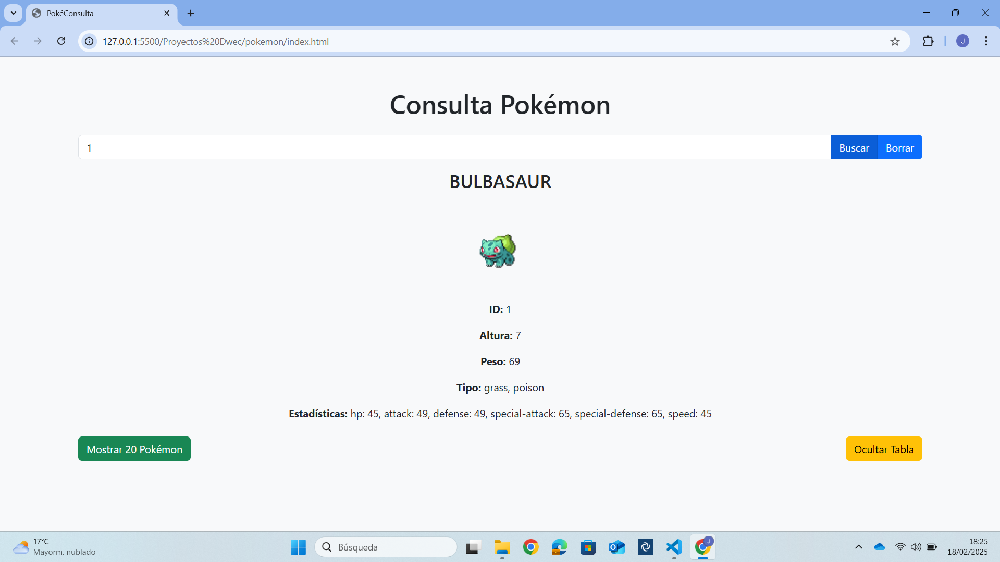
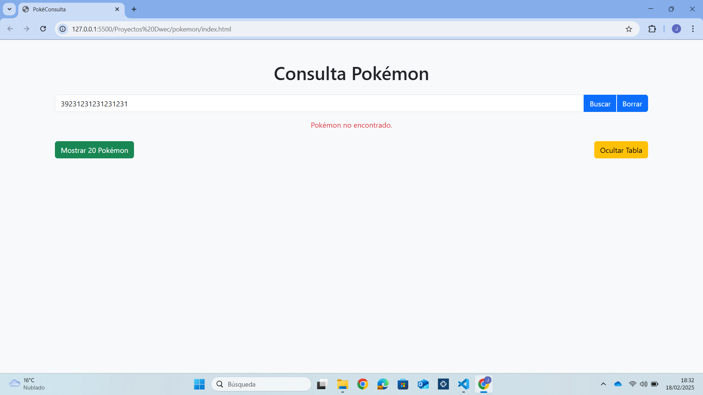
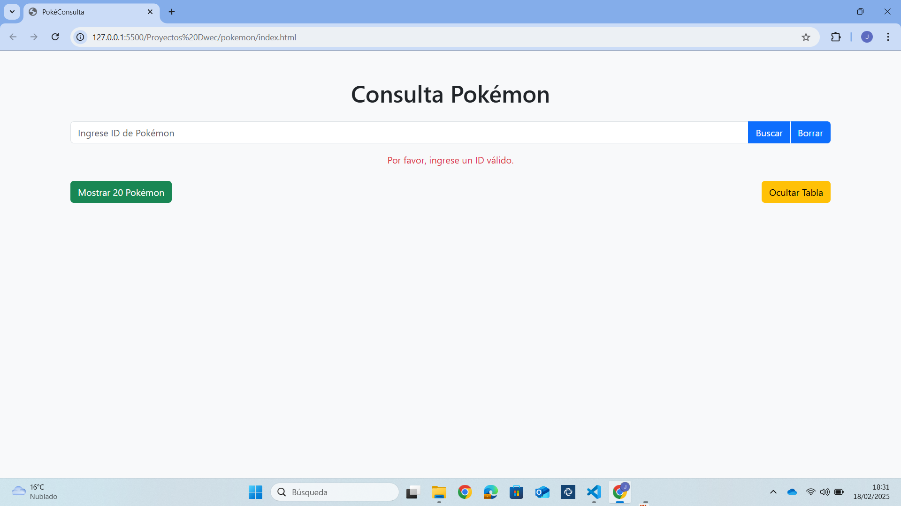
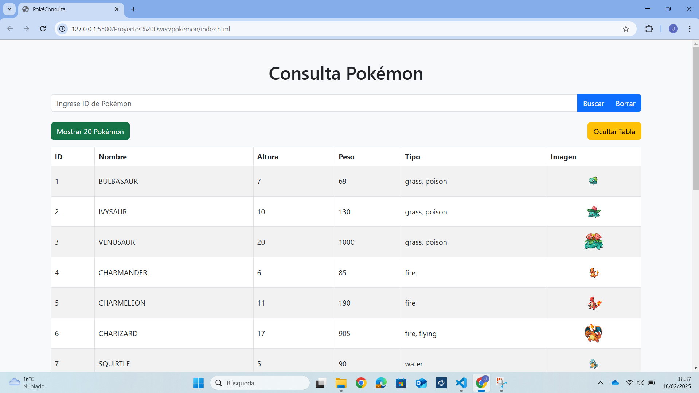
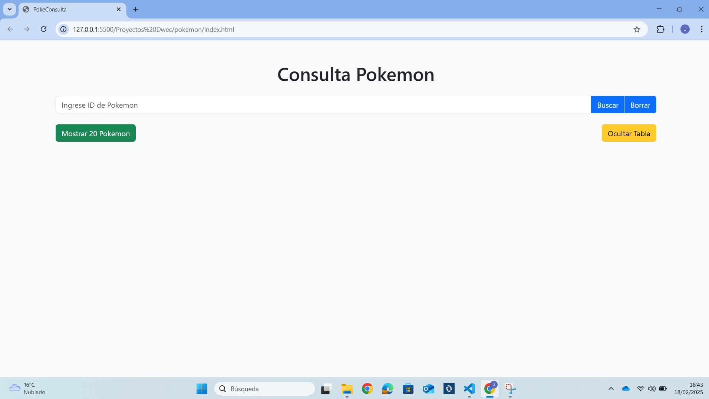

# PokeConsulta

## Introducción
Este proyecto tiene como objetivo la creación de una aplicación web que consulta información sobre Pokemon a través de la API de PokéAPI. Permite obtener información detallada de un Pokemon por su ID o mostrar una lista de 20 Pokemon.

## Requisitos
- Navegador web moderno (Chrome, Firefox, Edge).
- Conexión a Internet para acceder a la API de PokéAPI.

## Instrucciones para ejecutar la aplicación
1. **Descargar los archivos**: Asegúrate de tener los siguientes archivos en el mismo directorio:
   - `index.html`
   - `estilos.css` (opcional, para personalizar el estilo)
   - `script.js` (el código JavaScript que manejará las peticiones a la API)

2. **Abrir el archivo HTML**: Puedes abrir `index.html` en cualquier navegador como Chrome.

3. **Buscar un Pokemon por ID**: Ingresa un número de ID en el campo de entrada y haz clic en "Buscar" para obtener información sobre el Pokemon.

4. **Borrar Pokemon**: Si se pulsa el botón "Borrar", se limpia la información que se muestra del Pokemon en específico.

5. **Mostrar todos los Pokemon**: Haz clic en "Mostrar 20 Pokemon" para ver una lista de los primeros 20 Pokemon.

6. **Ocultar la tabla**: Haz clic en "Ocultar Tabla" para limpiar la vista de la tabla.

## Funcionalidades
1. **Consulta por ID**: Introduce el ID de un Pokemon para obtener su información.
2. **Mostrar 20 Pokemon**: Muestra una lista con los primeros 20 Pokemon.
3. **Borrar Pokemon**: Elimina la información de Pokemon mostrada.
4. **Ocultar tabla**: Oculta la tabla de Pokemon.

## Capturas de pantalla
### Consulta de Pokemon por ID

*La imagen muestra cómo se visualiza la información de un Pokemon cuando se ingresa un ID válido.*

### Consulta de Pokemon por ID (No se encuentra el Pokemon)

*La imagen muestra cómo se visualiza la información de un Pokemon cuando no se encuentra el pokemon.*

### Consulta de Pokemon por ID (No se introduce ID)

*La imagen muestra cómo se visualiza la información de un Pokemon cuando no se ingresa un ID*

### Borrar info del Pokemon

*La imagen muestra cómo se borra la información de un Pokemon cuando se pulsa el botón de borrar.*

### Lista de Pokemon 

*La imagen muestra cómo se visualiza una tabla de Pokemon, con algunos datos de interés, al pulsar el botón 'mostrar 20 Pokemon'.*

### Borrar tabla de Pokemon 

*La imagen muestra cómo se oculta/borra una tabla de Pokemon, al pulsar el botón 'Ocultar Tabla'.*

## Posibles problemas y errores
- **Problema de conexión a la API**: Si la API de Pokemon está caída o hay problemas con la conexión a Internet, los botones de búsqueda pueden mostrar un mensaje de error.
  
- **ID no válido**: Si se ingresa un ID no válido o inexistente, el sistema mostrará un mensaje de "Pokemon no encontrado".

- **Errores al cargar la lista de Pokemon**: Si no se pueden cargar los 20 Pokemon desde la API, la tabla mostrará un mensaje de error.

- **Problemas de visualización en móviles**: Aunque se ha ajustado el estilo de la web dependiendo de la resolución, puede que la tabla o los botones no se ajusten correctamente en pantallas más pequeñas.

## Conclusión
La aplicación cumple con su propósito de mostrar información de Pokemon de manera rápida y eficiente. Se pueden realizar mejoras en la adaptación a dispositivos móviles.

## Bibliografía
- [PokéAPI](https://pokeapi.co/)

