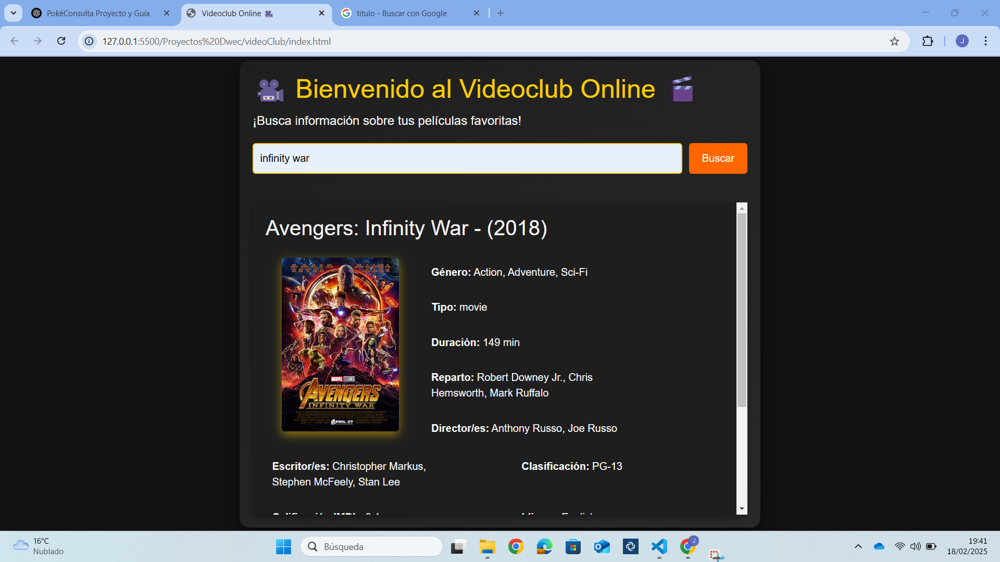
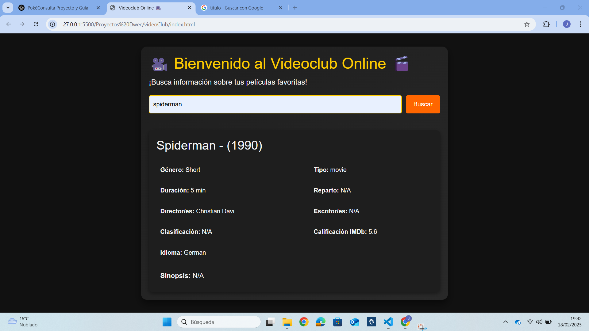
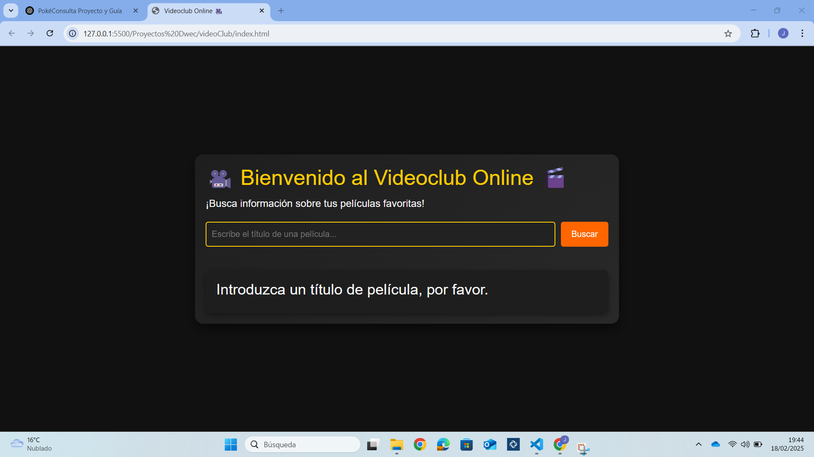

# VideoClub

## Introducción
Este proyecto permite buscar información sobre películas a través de la API de OMDb. Los usuarios pueden consultar detalles de una película ingresando su título y recibir información relevante sobre ella.

## Requisitos
- Navegador web moderno (Chrome, Firefox, Edge).
- Conexión a Internet para acceder a la API de OMDb.

## Instrucciones para ejecutar la aplicación
1. **Descargar los archivos**: Asegúrate de tener los siguientes archivos en el mismo directorio:
   - `index.html`
   - `estilos.css` (opcional, para personalizar el estilo)
   - `script.js` (el código JavaScript que manejará las peticiones a la API)

2. **Abrir el archivo HTML**: Puedes abrir `index.html` en cualquier navegador como Chrome.

3. **Buscar una película**: Ingresa el título de una película en el campo de entrada y haz clic en "Buscar" para obtener información sobre ella.
    Ejemplo: Introduzca el titulo: 'Infinity War'.

## Funcionalidades
1. **Buscar Pelicula por el título**: Introduce el titulo de una pelicula para obtener información de la misma.

## Capturas de pantalla
### Buscar película por el título con Poster

**La imagen muestra cómo se visualiza la información de la pelicula, con poster incluido.*

### Buscar película por el título con Poster

*La imagen muestra cómo se visualiza la información de la pelicula con diferente distribución a las películas con posters.*

### Buscar película por el título que no esta en la API

*La imagen muestra cómo aparece un mensaje de error en la web, al no encontrar la película.*

### No introducir ningún título y darle a Buscar

*La imagen muestra cómo aparece un mensaje de error en la web para que se envíe un título.*

## Posibles problemas y errores
- **Problema de conexión a la API**: Si la API de OMDb no responde o hay problemas con la conexión a Internet, aparecerá un mensaje de error.
  
- **Película no encontrada**: Si el título ingresado no existe o contiene errores tipográficos, el sistema mostrará un mensaje indicando que no se encontraron resultados.

- **Errores al cargar la lista de Pokemon**: Si no se pueden cargar los 20 Pokemon desde la API, la tabla mostrará un mensaje de error.

- **Problemas de visualización en móviles**: Aunque se ha ajustado el estilo de la web dependiendo de la resolución, puede que los elementos de la web no se ajusten correctamente en pantallas más pequeñas.

## Conclusión
La aplicación permite realizar búsquedas rápidas y efectivas de información sobre películas. Se pueden mejorar aspectos como la optimización en dispositivos móviles y la integración de filtros avanzados.

## Bibliografía
- [OMDb API](http://www.omdbapi.com/)